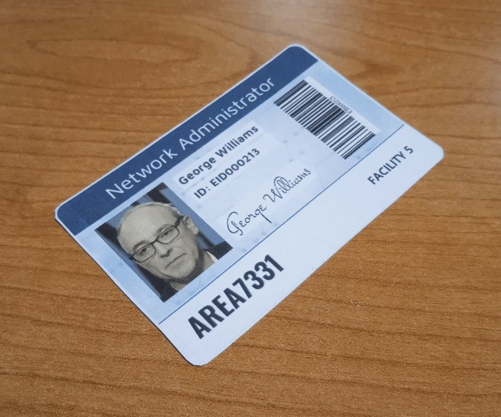
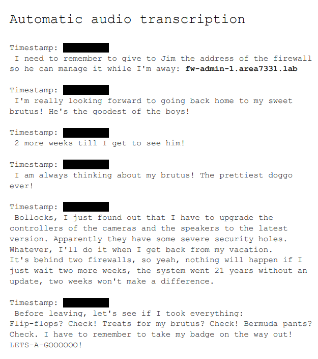
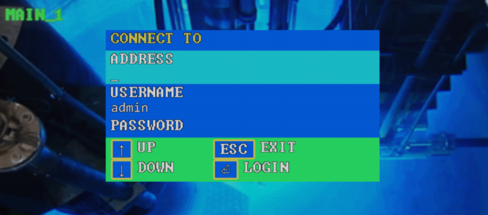
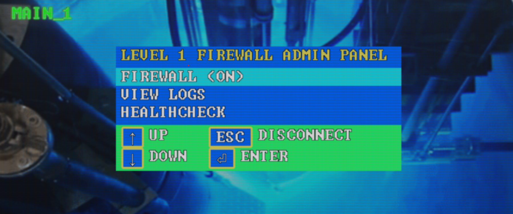
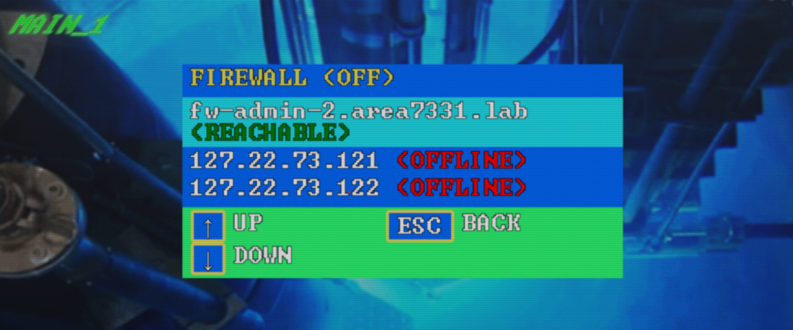
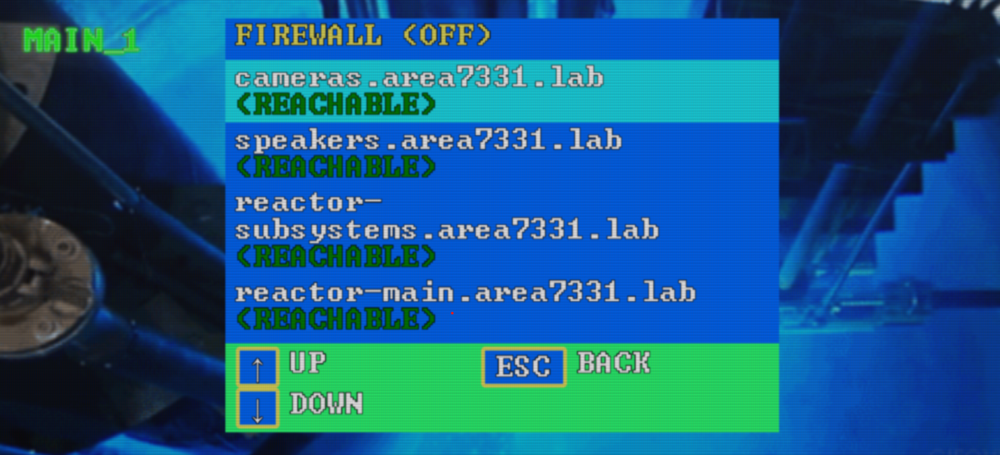
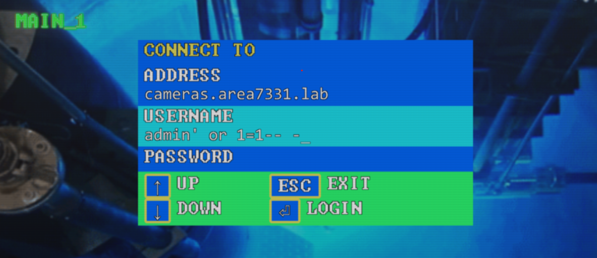
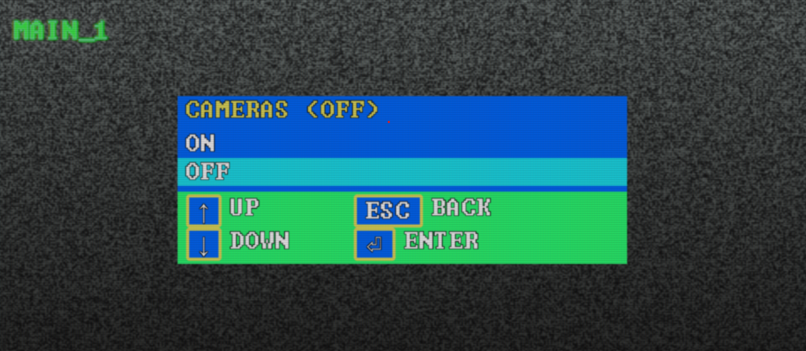
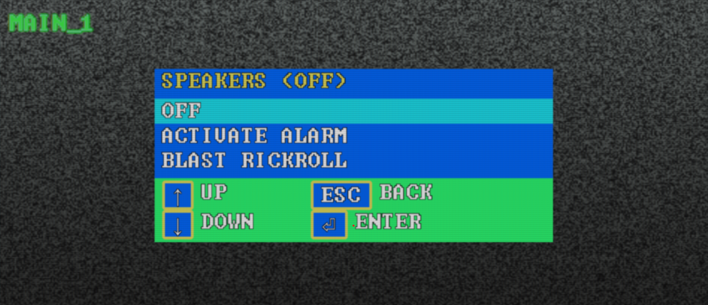

Questa challenge è la seconda parte di AREA7331 (perciò avremo bisogno anche delle conoscenze della challenge precedente del quale al momento non viene pubblicato il writeup quindi verrannò date per scontate)
<!-->
Iniziamo la challenge esaminando il badge che ci viene fornito in questa foto:

Utilizzando il link della challenge precedente possiamo loggare con l'account dell'amministratore di rete costruendo la password come per la challenge precendente:

    id:
      eid000213@area7331.lab
    password:
      George-Williams-EID000213-AREA7331!
Per accedere dobbiamo prima resettare la password inviando una richiesta all'url:
<!-->
https://ctf-web-3.codeinthedark.dev/forgot
<!-->
inviando l'eid di George per tornare alla password di default.

Una volta fatto questo possiamo loggare attraverso il link utilizzando le credenziali scritte sopra 
<!-->
https://ctf-web-3.codeinthedark.dev/login
<!-->
e poter vedere i documenti dell'utente.
<!-->
Abbiamo la foto di un cane chiamato Brutus (ci servirà più avanti)
ed un documento dove ci sono informazioni fondamentali per accedere al mainframe.

seguendo queste info saremo in grado di entrare all'interno del mainframe e muoverci all'interno dei vari livelli
<!-->
Accedendo al seguente link:
<!-->
https://ctf-web-5.codeinthedark.dev/
<!-->
potremo vedere questo:
<!-->

<!-->
inserendo le seguenti credenziali loggeremo nel primo livello:
    address:
        fw-admin-1.area7331.lab
    user:
        admin
    password:
        brutus
<!-->
Adesso siamo all'interno del primo pannello, perciò dobbiamo disabilitare il firewall(così per tutti i pannelli successivi)

andare sull'healthcheck dove troveremo l'address del secondo indirizzo a cui accedere _"fw-admin-2.area7331.lab"_.
https://github.com/Disturbante/citd-CTF-Area7331-2-Going-Nuclear-writeup/blob/main/pic/

Accedendo al secondo pannello e seguendo i passi precedenti cioè disattivare il firewall e poi navigare nella sezione healtcheck dove è possibile notare altri indirizzi raggiungibili quali:

Ora provando ad accedere all'indirizzo _"cameras.area7331.lab"_ o _"speakers.camera7331.lab"_, le credenziali sarrannò errate però andando a rileggere il documento all'interno dell'account di _"George Williams"_, possiamo apprendere che sta utilizzando una tecnologi molto antiquata per i controlli, quindi l'idea più semplice per bypassare un form  di login è tramite una sqlinjection come in foto:

il risultato ottenuto è l'accesso e la disattivazione delle camere:

Possiamo continuare con lo stesso procedimento andando a disattivare gli speakers:

La situazione ora cambia perchè provando la stessa metodologia con i due indirizzi _"reactor-subsystems.area7331.lab"_ e _"reactor-main.area7331.lab"_ non avremmo accesso in quanto l'utente admin non è quello giusto

